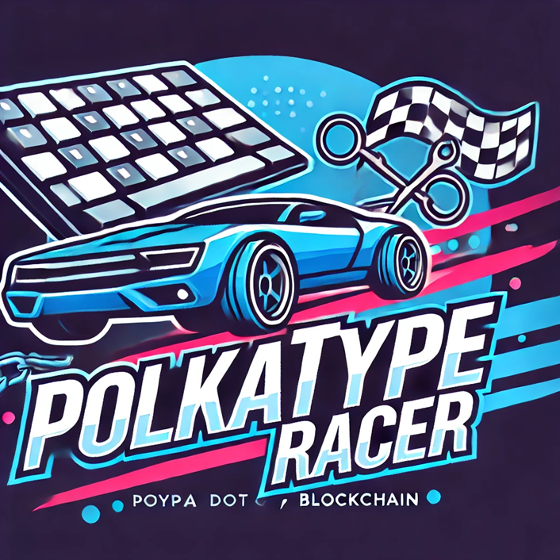

# PolkaTypeRace - 3rd Place at EasyA x Polkadot Harvard Hackathon

<!-- Add image in /public/polkaTypeRacer.png-->


```sh
npm install
npx partykit dev
npm run start
```

## PartyKit Integration

This project integrates with PartyKit to manage real-time game state and interactions.

- Main PartyKit entry point: [`party/index.ts`](./party/index.ts)
- Game state management: [`party/index.ts`](./party/index.ts) and [`src/pages/Racecar.tsx`](./src/pages/Racecar.tsx)
- Start game function: [`startGame`](./party/index.ts)

## Racecar Typing Game

The Racecar Typing Game is an interactive and competitive typing game where players race against each other by typing a given prompt as quickly and accurately as possible. The game tracks each player's progress in real-time and displays it visually using progress bars and car images.

### Features

- **Real-time Progress Tracking**: Players' typing progress is updated in real-time and displayed on the screen.
- **Multiplayer Support**: Multiple players can join the game and compete against each other.
- **Winner Notification**: The game announces the winner once a player completes the prompt.
- **Persistent State**: The game state, including progress and winner information, is stored in `localStorage` to maintain state across sessions.

### How to Play

1. **Join the Game**: Players join the game by connecting to the server.
2. **Start Typing**: Each player types the given prompt in the input box.
3. **Track Progress**: Players can see their progress and the progress of other players in real-time.
4. **Win the Game**: The first player to complete the prompt is declared the winner.

### Components

- **RacecarPage**: The main component that renders the game interface and handles the game logic.
- **AccountsContext**: Provides account-related information and functions.
- **PartySocket**: Manages the WebSocket connection to the server for real-time updates.
- **MarketPlace**: Buy with your trophies, powerups

### Key Functions

- **handleInputChange**: Handles changes in the input box and updates the player's progress.
- **updateProgress**: Updates the progress bar and checks for a winner.
- **incrementAsyncWinnerToken**: Increments the winner token asynchronously when a player wins.


This boilerplate aims to simplify working with Unique Network and Unique SDK.

> [!TIP]
> Unique SDK-2.0-alpha released. If you want to try it out proceed to https://github.com/UniqueNetwork/accounts-react-example/tree/sdk-2

## Unique Network SDK

This boilerplate utilizes `@unique-nft/sdk` which allows an easy and efficient way to interact with substrate-based networks.

Learn how to:
- connect to SDK: [`src/sdk/SdkContext.tsx`](./src/sdk/SdkContext.tsx)
- subscribe and listen to balances: [`src/balances/useBalances.ts`](./src/balances/useBalances.ts)
- transfer native tokens: [`src/modals/TransferAmountModal.tsx`](./src/modals/TransferAmountModal.tsx)

Read more about SDK in [documentation](https://docs.unique.network/build/sdk/getting-started.html)

## Wallets

This boilerplate supports `Polkadot{.js}` and `MetaMask` wallets as well as Local signers.

- learn how to connect wallets: [`src/accounts`](./src/accounts/)
- learn how to create a local signer: [`src/accounts/LocalAccountSigner.ts`](./src/accounts/LocalAccountSigner.ts)
- read more about working with accounts in [documentation](https://docs.unique.network/tutorials/work-with-accounts.html) 
